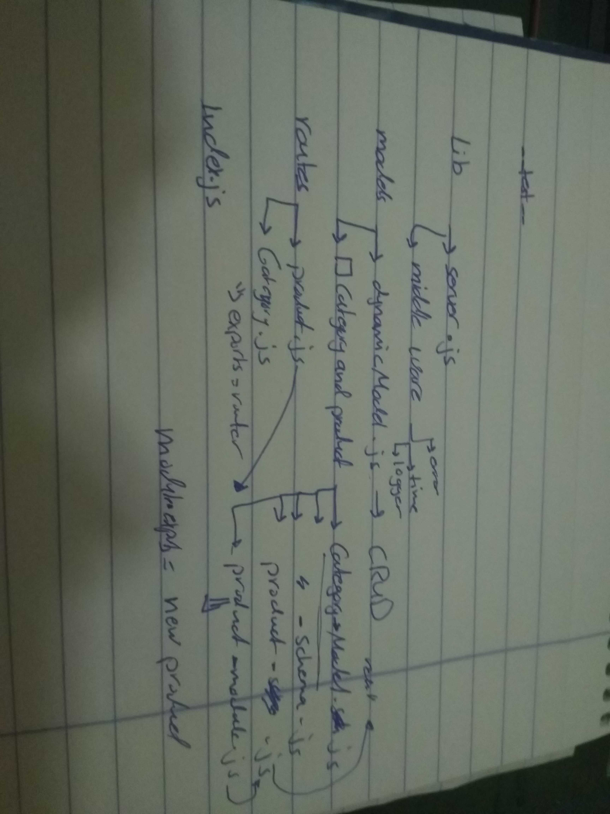

# class-09-API-Server

Author:
mai yousef 

Links and Resources
### submission PR 
https://github.com/401-advanced-javascript-Mai/class-09-API-Server/pulls
 ### ci/cd 
 https://github.com/401-advanced-javascript-Mai/class-09-API-Server/actions

## How to initialize/run your application (where applicable)
npm run start

## Tests How do you run tests?
npm run test

## Any tests of note? no Describe any tests that you did not complete, skipped, etc?
also delete test not done 

## uml 
the same as uml in lab 8 becaue i was doing the modelurizing jyst i connect the schema with each other for products and category 

